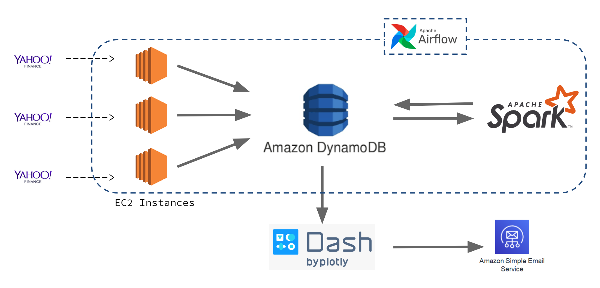

# Personal Stock Broker
Providing (near) Real-time Analytics on personal portfolio
## Table of Contents

1. [Motivation and Goal](README.md#motivation-and-goal)
2. [Data Description](README.md#data-description)
3. [Data Pipeline](README.md#data-pipeline)
4. [Demo](README.md#demo)
5. [Engineering Challenges](README.md#engineering-challenges)
6. [Dashboard](README.md#dashboard)

### Motivation and Goal

A study by Federal Reserve Board in 2016 shows that almost 52% of the US families owned stocks either directly or as a part of a fund. Sometimes it is frustrating to miss on the stocks you are waiting for to invest in. So, my primary goal is to build a Stock Alert system to help an individual or a retail investor to understand which stocks are changing rapidly in his personal portfolio. It also helps him/her to decide on different BUY and SELL options.

### Data Description

I've considered approximately 2500 tickers for the project that are complied from famous stock market indices like S&P500, RUSSELL 1000, DOW JONES etc. I'm getting all my data from Yahoo Finance API. I have 2 types of data considered: Historic data and Real-time data. Historic data is a day-wise data and Real-time data is minute-by-minute data.

### Data Pipeline

- Initially data will be fetched from Yahoo Finance API and pre-process the data to store the data into Amazon DynamoDB from multiple EC2 instances.
- To calculate stock metrics on historic and real-time data, I used Apache Spark as my compute engine.
- To visualize and create a an alert system, I used Python Dash and Amazon SES.
- To monitor the pipeline and schedule all the sequential jobs, I deployed a server with Apache Airflow.

### Demo

[Here](https://docs.google.com/presentation/d/1jopFzHwVNrbB96JyidxgtD2v576uGP8pEXVhWw4IdNc/edit#slide=id.p) you can see the demo of my application and know how it works.

### Engineering Challenges

I initially I used MySQL as my data store on Amazon RDS, but data ingestion has become a problem. So, I used Amazon DynamoDB as it a managed service by AWS and has the capability to read and write simultaneously. We can tune the Read-Capacity-Units (RCU) and Write-Capacity-Units (WCU) according to our necessity and use-case.

### Dashboard

I've built the frontend using Python Dash with Dash core and html components along with CSS styling. Based on the list of tickers user provided and the threshold the user chose, an email alert will be triggered using Amazon SES after checking if the input set of tickers are valid.

### Contact Information

- [srujankumar.majeti@gmail.com](srujankumar.majeti@gmail.com)
